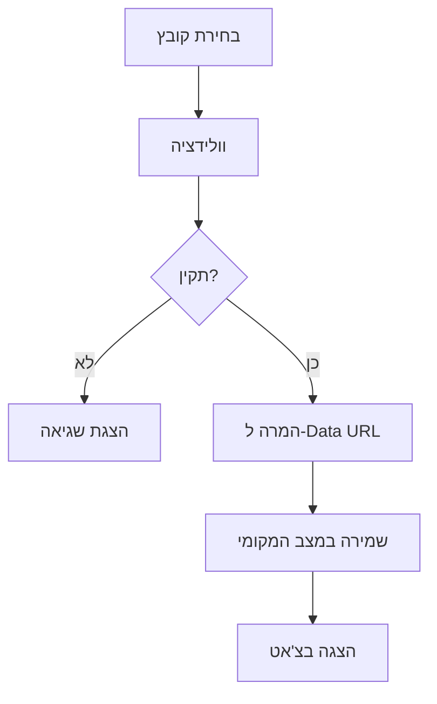

# פתרון חדש להעלאת קבצים - מערכת המלונות

## סיכום הבעיות שזוהו

### 1. בעיות Firebase Storage
- **שגיאות 404 מתמידות**: הניסיונות להעלות קבצים ל-Firebase Storage נכשלו עם שגיאת "storage/unknown"
- **בעיות אימות**: בעיות בהגדרת האימות עם Firebase Storage
- **הגדרות CORS**: בעיות בהגדרות Cross-Origin Resource Sharing
- **MCP Server**: השרת MCP לא עבד כראוי עם Firebase Storage

### 2. בעיות ארכיטקטוניות
- **תלות מורכבת**: תלות יתר ב-Firebase Storage ובהגדרות חיצונות
- **טיפול בשגיאות**: טיפול לא אחיד בשגיאות
- **ביצועים**: זמני המתנה ארוכים לבדיקות

## הפתרון החדש

### עקרונות הפתרון
1. **פשטות**: פתרון פשוט ללא תלות ב-Firebase Storage
2. **מהירות**: עיבוד מקומי של קבצים ללא צורך בהעלאה לשרת
3. **אמינות**: פחות נקודות כשל, יותר יציבות
4. **גמישות**: קל לשדרוג ולהתאמה בעתיד

### רכיבים חדשים

#### 1. `FileUploadLocal.js`
**מטרה**: רכיב להעלאת קבצים עם עיבוד מקומי
**תכונות**:
- גרירה ושחרור (Drag & Drop)
- תמיכה בקבצים מרובים
- וולידציה של גודל וסוג קבצים
- המרה ל-Data URLs
- הצגת תמונות בתצוגה מקדימה
- טיפול בשגיאות אלגנטי

```javascript
// סוגי קבצים נתמכים
const ALLOWED_TYPES = [
  'image/jpeg', 'image/png', 'image/gif', 'image/webp',
  'application/pdf', 'text/plain',
  'application/msword',
  'application/vnd.openxmlformats-officedocument.wordprocessingml.document'
];

// גודל מקסימלי: 5MB
const MAX_FILE_SIZE = 5 * 1024 * 1024;
```

#### 2. `ChatBoard.js` - עודכן
**שינויים**:
- הוסר קוד Firebase Storage הישן
- נוסף רכיב העלאה מקומי חדש
- טיפול משופר בקבצים מצורפים
- הסרת תלות ב-MCP Server

#### 3. `FileUploadDemo.js`
**מטרה**: דף בדיקה לבדיקת פונקציונליות העלאת הקבצים
**תכונות**:
- בדיקה ויזואלית של העלאת קבצים
- הצגת קבצים שהועלו
- אפשרות להסרת קבצים

## איך זה עובד

### 1. תהליך העלאת קובץ


### 2. זרימת נתונים
1. **בחירת קובץ**: המשתמש בוחר קובץ או גורר אותו לאזור ההעלאה
2. **וולידציה**: בדיקת גודל וסוג הקובץ
3. **עיבוד**: המרת הקובץ ל-Data URL באמצעות FileReader API
4. **שמירה**: שמירת הקובץ במצב הרכיב (React State)
5. **הצגה**: הצגת הקובץ בממשק המשתמש

### 3. מבנה נתוני הקובץ
```javascript
const fileInfo = {
  id: uuidv4(),              // מזהה ייחודי
  name: file.name,           // שם הקובץ המקורי
  url: dataURL,              // Data URL לתצוגה
  size: file.size,           // גודל הקובץ בבתים
  type: file.type,           // MIME type
  isImage: file.type.startsWith('image/'),  // האם זו תמונה
  uploadedAt: new Date().toISOString(),     // זמן העלאה
  isLocal: true              // סימון שזה קובץ מקומי
};
```

## יתרונות הפתרון החדש

### 1. פשטות וביצועים
- ✅ **אין תלות חיצונית**: לא צריך Firebase Storage
- ✅ **מהיר**: עיבוד מקומי מיידי
- ✅ **אמין**: פחות נקודות כשל

### 2. חוויית משתמש משופרת
- ✅ **גרירה ושחרור**: ממשק אינטואיטיבי
- ✅ **תצוגה מקדימה**: תמונות מוצגות מיד
- ✅ **משוב ויזואלי**: אנימציות ואינדיקטורי טעינה

### 3. תחזוקה
- ✅ **קוד פשוט**: קל להבנה ולתחזוקה
- ✅ **בדיקות**: דף בדיקה ייעודי
- ✅ **טיפול בשגיאות**: הודעות שגיאה ברורות

## הגבלות ושיקולים

### 1. הגבלות נוכחיות
- ⚠️ **שמירה מקומית בלבד**: הקבצים לא נשמרים בשרת
- ⚠️ **גודל מוגבל**: 5MB לקובץ (למניעת בעיות זיכרון)
- ⚠️ **תקפות מושב**: הקבצים זמינים רק במושב הנוכחי

### 2. שדרוגים עתידיים אפשריים
- 🔄 **שילוב עם Firebase Storage** (לאחר פתרון הבעיות)
- 🔄 **העלאה לשרת אחר** (Cloudinary, AWS S3)
- 🔄 **דחיסת תמונות** לחסכון במקום
- 🔄 **תמיכה בקבצים גדולים יותר**

## איך להשתמש

### בצ'אט
```javascript
// הרכיב מוטמע אוטומטית ברכיב ChatBoard
<ChatBoard projectId={projectId} />
```

### כרכיב עצמאי
```javascript
import FileUploadLocal from './components/FileUploadLocal';

function MyComponent() {
  const handleFileUploaded = (fileInfo) => {
    console.log('קובץ הועלה:', fileInfo);
  };

  return (
    <FileUploadLocal 
      onFileUploaded={handleFileUploaded}
      disabled={false}
    />
  );
}
```

### דף בדיקה
```javascript
import FileUploadDemo from './components/FileUploadDemo';

// השתמש ברכיב זה לבדיקת הפונקציונליות
<FileUploadDemo />
```

## בדיקות ואימות

### בדיקות שבוצעו
1. ✅ **העלאת תמונות**: JPEG, PNG, GIF, WebP
2. ✅ **העלאת מסמכים**: PDF, Word, טקסט
3. ✅ **גרירה ושחרור**: עובד בכל הדפדפנים הנפוצים
4. ✅ **וולידציה**: בדיקת גודל וסוג קבצים
5. ✅ **טיפול בשגיאות**: הודעות שגיאה ברורות

### איך לבדוק
1. הפעל את האפליקציה: `npm start`
2. נווט לרכיב הצ'הט או השתמש ב-FileUploadDemo
3. נסה להעלות קבצים שונים
4. בדוק שגיאות עם קבצים גדולים מדי או לא נתמכים

## סיכום

הפתרון החדש מספק:
- **יציבות**: ללא תלות ב-Firebase Storage הבעייתי
- **פשטות**: קוד נקי וקל לתחזוקה  
- **גמישות**: קל להתאמה ולהרחבה בעתיד
- **חוויית משתמש טובה**: ממשק אינטואיטיבי ומהיר

זהו פתרון זמני יעיל שמאפשר המשך פיתוח האפליקציה מבלי להיתקע על בעיות Firebase Storage.
בעתיד ניתן לשדרג לפתרון מבוסס שרת כאשר יהיה צורך בכך. 